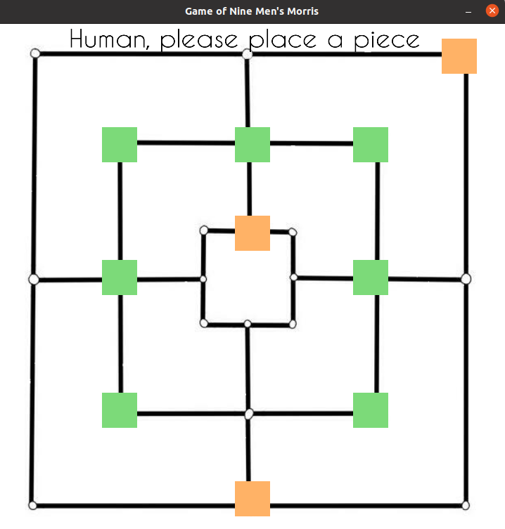

# Lasker Morris
This is a project implementing an AI for the Nine Men's Morris game, using the alpha-beta pruning algorithm and giving a bound on the depth search of the gaming tree.



### Prerequisites
In order to run it you need to have the following libraries installed 


```
SDL2 
SDL2_image 
SDL2_ttf
```

### How to play
Run the following commands in a terminal:


```
make
./NineMenMorris
```

## Author

* Mara Belotti
